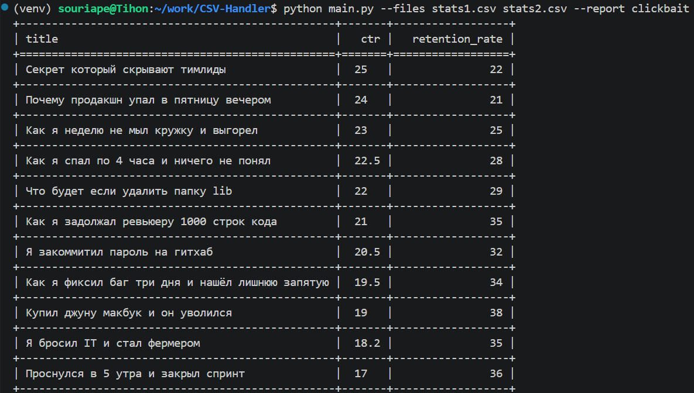

# YouTube Clickbait Report

Данное CLI-приложение читает один или несколько CSV-файлов с метриками YouTube-видео и строит отчёт `clickbait`.
В отчёт попадают ролики, у которых одновременно `ctr > 15` и `retention_rate < 40`.
Результат выводится в консоль таблицей и сортируется по убыванию CTR.

## Архитектура
Точка входа находится в main.py, а основная логика вынесена в пакет youtube_reports. Чтение CSV, построение отчёта и вывод таблицы разделены по разным модулям. **Чтобы добавить новый отчёт нужно создать класс отчёта и зарегистрировать его в REPORTS.**

## Установка
Лучше использовать виртуальное окружение, оно изолирует зависимости и гарантирует корректную работу на любой ОС:

```bash
# Создаём окружение
python3 -m venv .venv   # Linux/MacOS
python -m venv .venv    # Windows

# Активация
source .venv/bin/activate       # Для Linux/MacOS 
.venv\Scripts\activate          # Для Windows (cmd)
.venv\Scripts\Activate.ps1      # Для Windows (PowerShell)

# Устанавливаем зависимости
pip install -r requirements.txt
```

## Пример запуска

```bash
python main.py --files stats1.csv stats2.csv --report clickbait
```

Пример полного вывода сохранён в `examples/clickbait_report.txt`.  
А также в виде скриншота `examples/clickbait_report.png`.



## Запуск тестов

```bash
pip install -r requirements-dev.txt
python -m pytest
```
